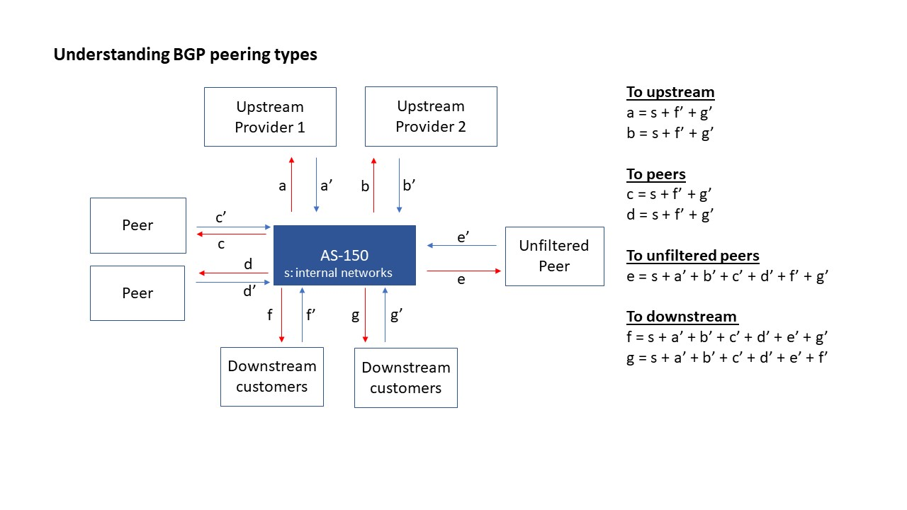

# Manual: BGP Peering

<a name="bgp-rs-peering"></a>
## BGP: Peering Using Route Server

```
ebgp.addRsPeer(100, 150)
ebgp.addRsPeers(100, [150, 151])
```

The `Ebgp::addRsPeer` and `Ebgp::addRsPeers` calls take two parameters; the first is an internet
exchange ID, and the second is ASN or a list of ASNs. 
They will configure the peering between the
given ASN(s) and the given internet exchange's route server (i.e., setting up
Multi-Lateral Peering Agreement (MLPA)). Note that the session with RS will
always be `Peer` relationship.

The eBGP layer sets up peering by looking for the router node of the given
autonomous system from within the internet exchange network. So as long as
there is a router of that AS in the exchange network (i.e., joined the IX with
`as15X_router.joinNetwork('ix100')`), the eBGP layer should be able to set up
the peeing.


<a name="bgp-private-peering"></a>
## BGP: Private Peering

```
# Create a private peering between AS150 and AS151 inside IX100
ebgp.addPrivatePeering(100, 150, 151, abRelationship = PeerRelationship.Provider)
```

The `Ebgp::addPrivatePeering` call takes four parameters; internet exchange ID,
first ASN, the second ASN, and the relationship. The relationship parameter
defaults to `Peer`. The call will configure peering between the two given ASNs
in the given exchange. 

The peering relationship can be one of the followings:

- `PeerRelationship.Provider`: The first ASN is considered as the upstream
  provider of the second ASN. The first ASN will export all routes to the
  second ASN, and the second ASN will only export its customers' and its own
  prefixes to the first ASN. In this type of peering, the second AS is considered
  as the customer of the first one, and the routes coming from the second AS
  will be marked as the customer routes. 

- `PeerRelationship.Peer`: The two ASNs are considered as peers. Both sides
  will only export their customers and their own prefixes. However, when A exports 
  its routes to B through this type of peering, B will not mark A's routes 
  as its customer routers, and therefore will not further export them to 
  another peer C, unless B and C peers using the `Unfiltered` type (see the following item). 

- `PeerRelationship.Unfiltered`: Make both sides export all routes to each other.


The eBGP layer sets up peering by looking for the router node of the given
autonomous system from within the internet exchange network. So as long as
there is a router of that AS in the exchange network (i.e., joined the IX with
`as15X_router.joinNetworkByName('ix100')`), the eBGP layer should be able to
setup peeing just fine.

  
<a name="peer-relationship"></a>
## Peer Relationship

The following diagram helps explain how routes are exported for three types of peering. The diagram shows how the `AS150` export its routes to its peers of various types, 
including upsteam providers (`AS150` is on the customized side of a `PeerRelationship.Provider` peering), 
downstream customers (`AS151` is on the provider side), `PeerRelationship.Peer` peers,
and `PeerRelationship.Unfiltered` peers.




